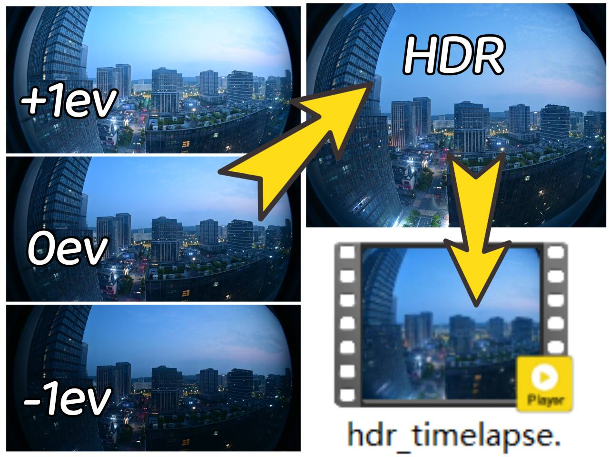
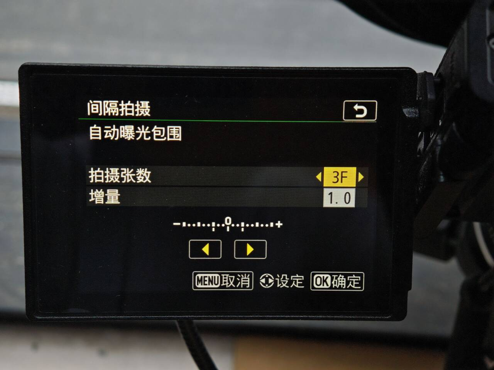
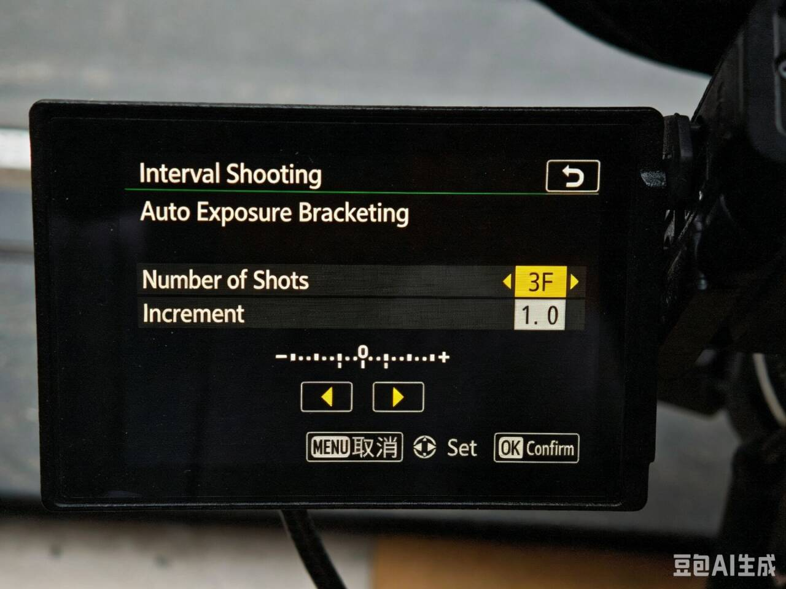
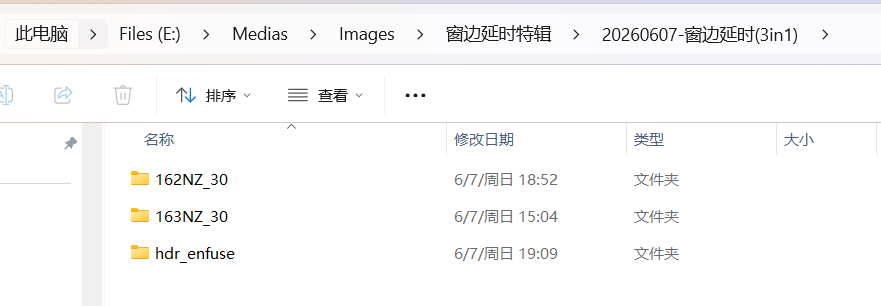

<p align="center">
  
</p>

<p align="center">
  <a href="README.md">English</a> | 简体中文
</p>

# Bracketlapse

Bracketlapse 是一个跨平台命令行工具，用于处理包围曝光延时摄影素材：

- 每 3 张 JPG 合成 1 张曝光融合后的 HDR 风格图片，合成由 Hugin `enfuse` 完成。
  默认 `enfuse` 参数为 `--exposure-width=0.05`、`--exposure-optimum=0.30`、
  `--saturation-weight=0` 和 `--contrast-weight=0`。
- 可选使用 Hugin `align_image_stack` 先对齐每组包围曝光照片。
- HDR 图片合成完成后，先使用 `simple-deflicker` 对合成序列去闪，再使用 `ffmpeg`
  从去闪后的序列生成 HEVC/H.265 MP4 延时视频。
- 特别适用于尼康（Nikon）和富士（FUJIFILM）相机，因为它们可以在延时摄影过程中自动拍摄包围曝光。本程序使用我自己的尼康 Z30 测试。

<p align="center">
  
  
</p>

支持 Windows 和 macOS，需要 Python 3.10 或更高版本。

## 依赖

Bracketlapse 启动时会根据当前选择的管线检查所需工具，并尝试自动准备缺少的环境。

运行时工具包括：

- Hugin 命令行工具：`enfuse`，以及可选的 `align_image_stack`。
- `simple-deflicker` 的 `dev_2026` 分支。
- `ffmpeg`。

自动准备会优先使用本机包管理器：macOS 使用 Homebrew，Windows 使用 winget 或 Chocolatey，Linux 使用 apt/dnf/pacman。如果缺少 `simple-deflicker`，Bracketlapse 会克隆 `dev_2026` 分支并构建到 `~/.cache/bracketlapse/tools/bin`，这一步需要 `git` 和 Go。
如果某个必需工具无法自动准备，Bracketlapse 会在正式处理开始前停止，并报告缺少的工具。

在 Windows 上，如果 Hugin 安装在 `D:\Medias\Hugin\bin`，请把这个目录加入当前用户的 `PATH`。

## 开发安装

在本仓库目录下运行：

```powershell
python -m pip install -e .
```

macOS 上如果没有 `python` 命令，可以使用：

```bash
python3 -m pip install -e .
```

## 使用方法

处理一个包围曝光 JPG 目录，并在完成后自动生成视频：

```bash
bracketlapse "E:\Medias\Images\example"
```

如果不提供目录，程序会询问处理目录：

```bash
bracketlapse
```

待机模式会持续监控一个目录，直到其递归文件数在相邻两次扫描之间不再增加，然后把该目录内的全部内容移动到目标目录下当天日期命名的文件夹中，再在该文件夹内继续执行普通的合成和视频流程：

```bash
bracketlapse --standby 监听目录 目标目录 静息判定时间 [loop]
```

监听期间会每隔一次参数3的时长输出一条状态日志。

如果当天的 `20260609` 已经存在，后续会自动使用 `20260609-1`、`20260609-2` 这样的名称。

当输入文件名包含连续序号且其中有序号缺失时，会跳过对应的 HDR 组，后面的组继续保持对齐，并输出警告日志。

如果在一个包含图片子文件夹的目录中运行 Bracketlapse（这很常见，因为相机的存储格式通常对单文件夹存放的最大照片数量有严格限制），程序会先询问是否合并处理多个子文件夹。合并模式下，用户选择的子文件夹作为输入，`hdr_enfuse`、`hdr_deflick` 和 `hdr_video` 仍然创建在当前工作目录下。

<p align="center">
  
</p>

合并所有检测到的图片子文件夹：

```bash
bracketlapse --merge-subdirs
```

合并指定子文件夹：

```bash
bracketlapse --merge-dirs part1 part2 part3
```

忽略子文件夹，只处理当前选择的目录：

```bash
bracketlapse --no-merge-subdirs
```

默认按文件名排序，并且每 3 张 JPG 作为一组：

```text
DSC_0480.JPG, DSC_0481.JPG, DSC_0482.JPG -> hdr_00001.jpg
DSC_0483.JPG, DSC_0484.JPG, DSC_0485.JPG -> hdr_00002.jpg
```

如果输入文件总数不能被分组数量整除，Bracketlapse 会丢弃最后剩余的文件，打印 warning，并继续处理完整分组。

默认 HDR 图片输出目录是处理目录下的 `hdr_enfuse`。
默认去闪图片输出目录是处理目录下的 `hdr_deflick`。
最终视频会从 `hdr_deflick` 生成到处理目录下的 `hdr_video/hdr_timelapse.mp4`，视频编码为 HEVC/H.265。

如果包围曝光照片之间有轻微位移，可以启用对齐：

```bash
bracketlapse "E:\Medias\Images\example" --align
```

只测试前几组：

```bash
bracketlapse "E:\Medias\Images\example" --limit 3 --overwrite
```

只生成 HDR 图片，跳过去闪和自动视频合成：

```bash
bracketlapse "E:\Medias\Images\example" --no-video
```

指定自动视频参数：

```bash
bracketlapse "E:\Medias\Images\example" --fps 30 --video-output hdr_video\hdr_timelapse.mp4
```

指定 simple-deflicker 参数：

```bash
bracketlapse "E:\Medias\Images\example" --deflick-rolling-average 15 --deflick-jpeg-compression 95
```

如果可执行文件不是 `simple-deflicker` 这个名字，或没有加入 `PATH`，可以显式指定：

```bash
bracketlapse "E:\Medias\Images\example" --deflick-bin "D:\Tools\simple-deflicker.exe"
```

也可以手动把已有 JPG 帧目录合成为视频：

```bash
bracketlapse video "E:\Medias\Images\example\hdr_enfuse" --fps 30 --output hdr_timelapse.mp4
```

如果 `video` 命令不提供目录，也会询问处理目录：

```bash
bracketlapse video
```

## 常用选项

```bash
bracketlapse --help
bracketlapse video --help
```

重要选项：

- `--sort name|time`：按文件名或修改时间排序。
- `--output PATH`：自定义 HDR 图片输出目录。
- `--merge-subdirs`：合并所有检测到的图片子文件夹。
- `--merge-dirs DIR...`：合并指定子文件夹。
- `--no-merge-subdirs`：忽略子文件夹，只处理当前选择的目录。
- `--overwrite`：覆盖已有输出。
- `--align`：合成前先对齐每组包围曝光照片。
- `--ext jpg|tif`：选择 HDR 图片输出扩展名。
- `--no-video`：HDR 图片合成后跳过去闪和自动视频生成。
- `--fps`：视频帧率。
- `--video-output PATH`：自动生成视频的输出路径。
- `--deflick-output PATH`：去闪图片输出目录。
- `--deflick-bin PATH`：simple-deflicker 可执行文件名或路径。
- `--deflick-rolling-average`、`--deflick-jpeg-compression` 和 `--deflick-threads`：simple-deflicker 参数。
- `--crf` 和 `--preset`：x265 视频编码质量和速度参数。

## 许可证

Bracketlapse 使用 GNU General Public License v3.0 或更高版本授权。详情见 [LICENSE](LICENSE)。
